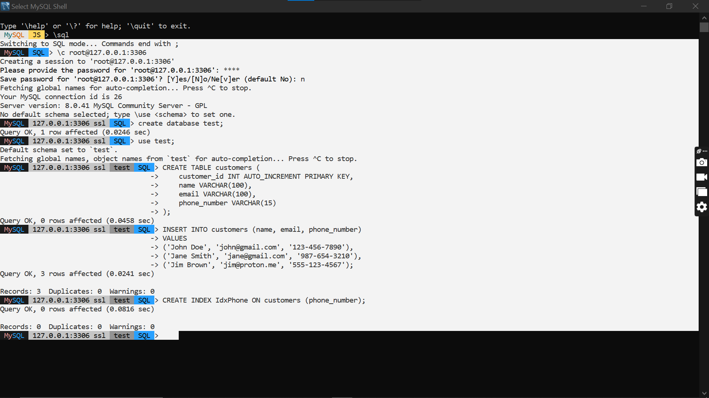
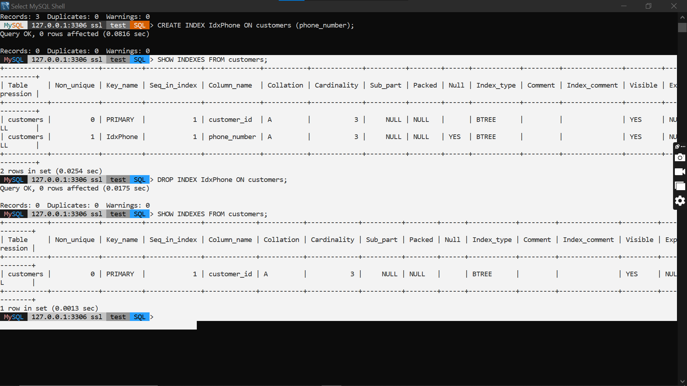
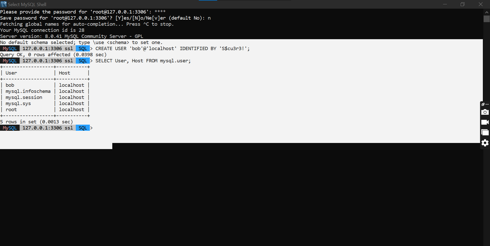
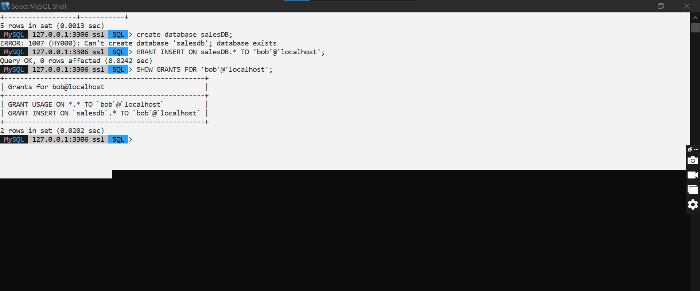

# 📝 Assignment: Database Indexing and Optimization

## 🎯 **Learning Objectives**
* ➕ Add indexes to tables and analyze their impact on query performance.
* 👤 Create user accounts and assign roles in a sample database.
* 🔒 Explore database security measures and access control for data protection.
* 💻 Practice advanced SQL queries based on real-world scenarios.

---

## 📋 **What You'll Need**
* 💻 A computer with internet access.
* ✍️ A code editor (e.g., Visual Studio Code).
* 🖥️ MySQL Workbench or another SQL database environment.

---

## 📝 Submission Instructions  
📂 Write all your SQL queries in the **answers.sql** file.  
✍️ Answer each question concisely and make sure your queries are clear and correct.  
🗣️ Structure your responses clearly, and use comments if necessary to explain your approach.

--- 

## 📚 Assignment Questions 
# I first created a database , a customer table, inserted some data and then create an index to test the drop operation

### **Question 1 🗑️** 
**Write an SQL query** to drop an index named **IdxPhone** from **customers** table.

---
### **Question 2 👤** 
 **Write an SQL query** to create a user named **bob** with the password _'S$cu3r3!'_ , restricted to the localhost hostname.

---
### **Question 3 🔑** 
 **Write an SQL query** to grant the **INSERT** privilege to the user **bob** on the **salesDB** database.

---
### **Question 4 🔐**
**Write an SQL query** to change the password for the user **bob** to _'P$55!23'_

---
Good luck 🚀